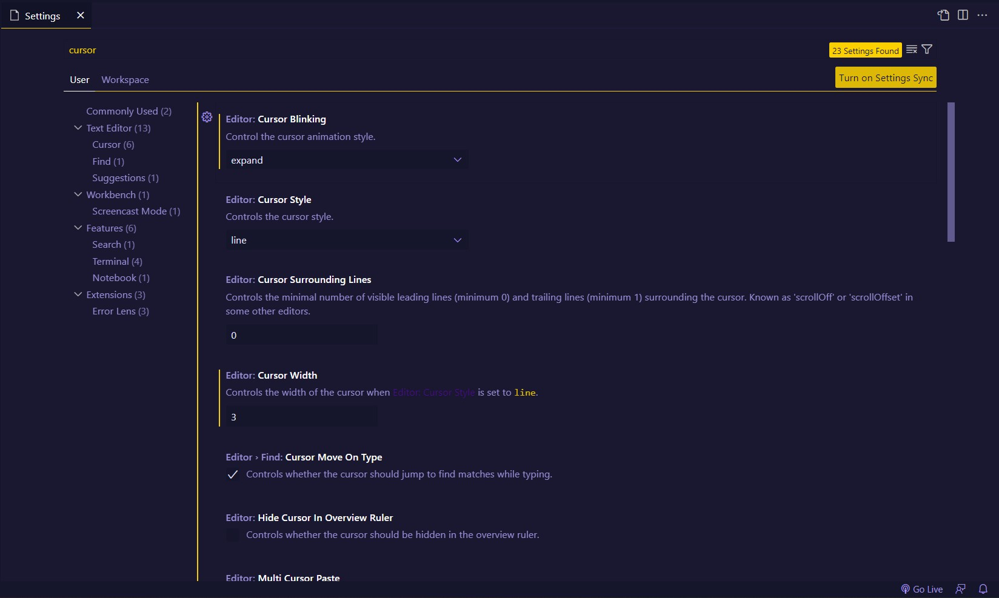
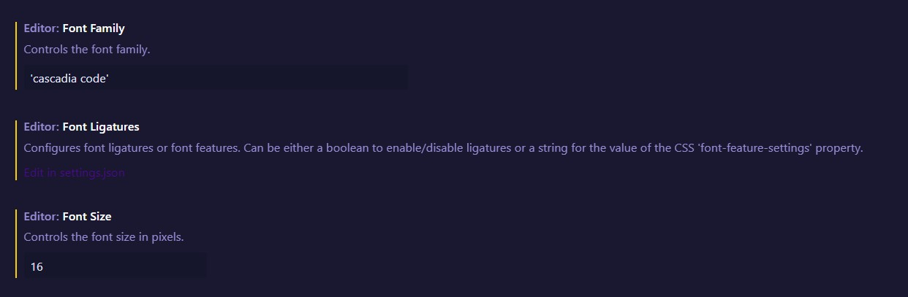

# My VSCode Settings

Collection of <a href="https://youtube.com/#AsmrProg" target="_blank">AsmrProg</a> Youtube Channel VSCode Extensions That We Used in Videos!

### Tutorial Video's

Find Video's on : <a href="https://youtube.com/@AsmrProg" target="_blank">AsmrProg</a> Youtube Channel

# Settings

Here are my vscode settings for Font and Cursor :  
  
Search for **"Cursor"** in VSCode settings and set this for cursor animations:

for Font i'm using **"Cascadia Code"** Font Family <a href="https://github.com/microsoft/cascadia-code" target="_blank">Download From Here</a> with 16px Size.

# Extensions List & Usage

Here are the list on Extensions that i'm using this days (We will update this post if we changed our Extensions) :

1. <a href="https://github.com/mike7515/code-beautifier" target="_blank">Beautify :</a> Beautify css, sass and less code (extension for Visual Studio Code).

2. <a href="https://github.com/kufii/CodeSnap" target="_blank">Codesnap :</a> We take our community posts screenshots (Tip of Day Posts) with this extension.

3. <a href="https://github.com/usernamehw/vscode-error-lens" target="_blank">Error Lens :</a> Improve highlighting of errors, warnings and other language diagnostics.

4. <a href="https://github.com/solnurkarim/HTML-to-CSS-autocompletion" target="_blank">HTML To CSS Autocompletion :</a> Provides completion suggestions for classes and ids from markup documents to stylesheets.

5. <a href="https://github.com/MicrosoftDocs/intellicode" target="_blank">Intellicode :</a> The Visual Studio IntelliCode extension provides AI-assisted development features for Python, TypeScript/JavaScript and Java developers in Visual Studio Code, with insights based on understanding your code context combined with machine learning.

6. <a href="https://github.com/vscode-icons/vscode-icons" target="_blank">VSCode Icons :</a> Icons for Visual Studio Code (files icons).

## My Live Code Result Extensions

1. <a href="https://github.com/ritwickdey/vscode-live-server" target="_blank">Live Server :</a> Launch a development local Server with live reload feature for static & dynamic pages.

2. <a href="https://github.com/microsoft/vscode-livepreview" target="_blank">Live Preview :</a> An extension that hosts a local server for you to preview your web projects on! (Updates preview without saving file).

## My Themes Extensions

I'm using <a href="https://github.com/hikarin522/GlassIt-VSC" target="_blank">Glassit-VSC</a> Extension to set window to transparent with all of my themes.

Here are my themes list :

1. <a href="https://github.com/ayu-theme/vscode-ayu" target="_blank">Ayu Theme</a>
2. <a href="https://github.com/ankitmlive/firefly-theme" target="_blank">Firefly Theme</a>
3. <a href="https://github.com/guilhermerodz/omni-owl" target="_blank">Omini Owl Theme</a>
4. <a href="https://github.com/barrsan/reui-vscode-theme" target="_blank">Reui Theme</a>
5. <a href="https://github.com/ahmadawais/shades-of-purple-vscode" target="_blank">Shades of Purple Theme</a>

# Note That

If you find this README.md file helpful please Star + Follow our github. Also we will be happy if you support us in Youtube.

<a href="https://Youtube.com/@AsmrProg" target="_blank">AsmrProg Youtube Channel</a>